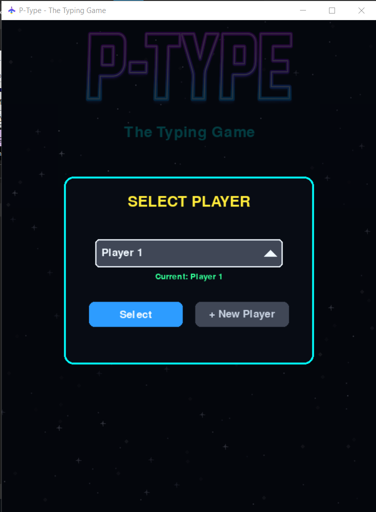
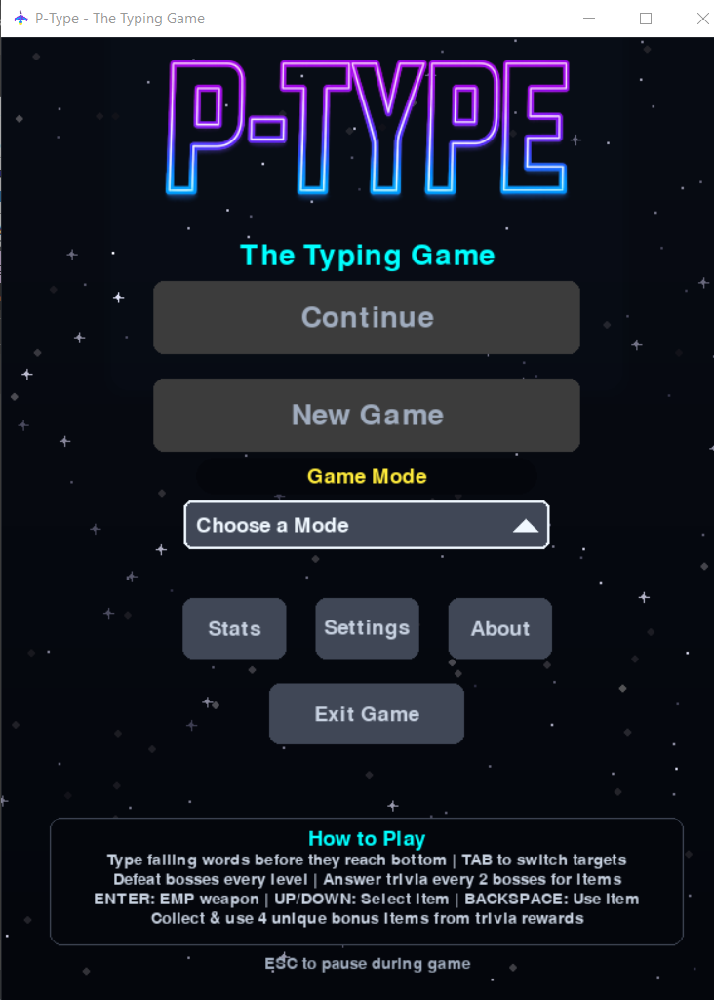
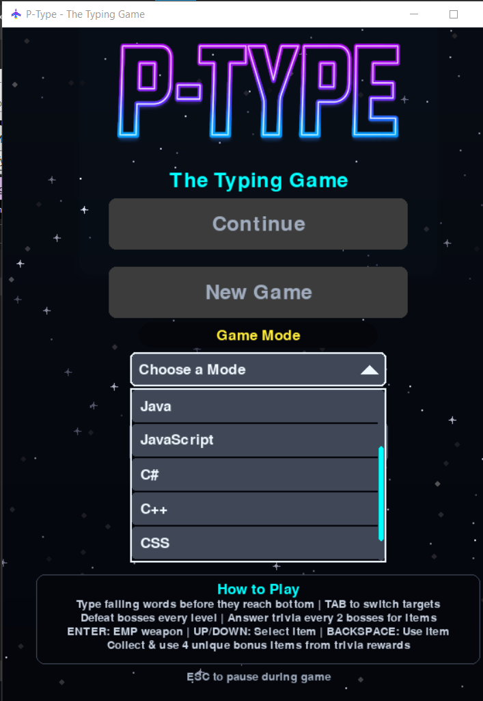
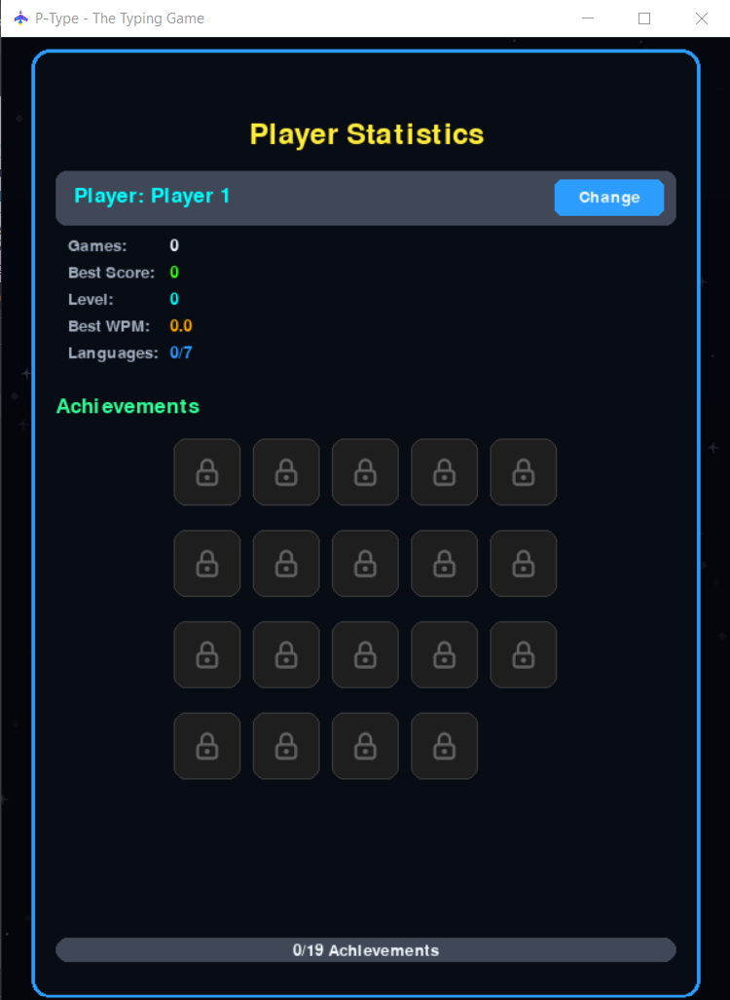
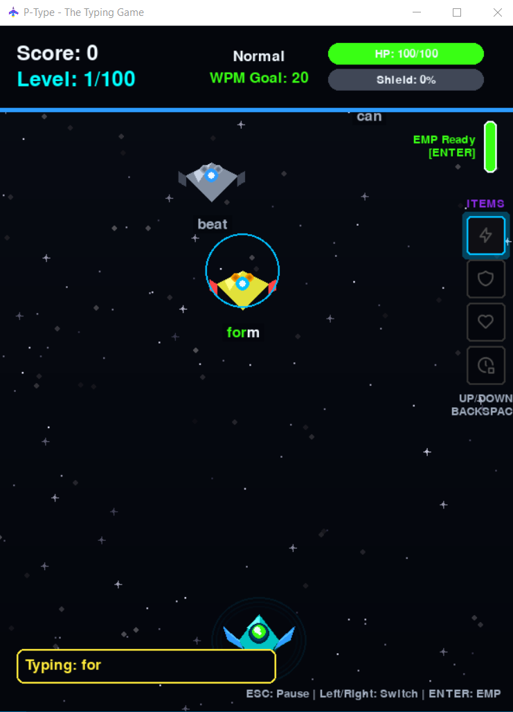
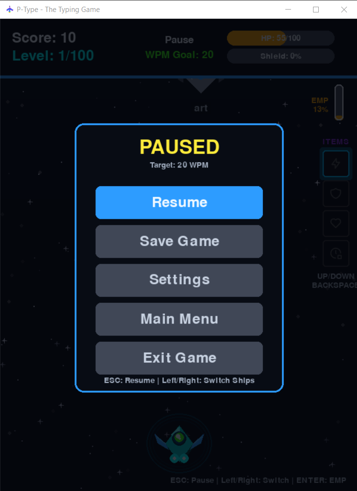

# P-Type - The Typing Game

[](https://github.com/yourusername/PType/releases)
[](https://www.python.org/)
[](LICENSE)

A modern typing game designed specifically for programmers to improve their coding speed and accuracy across multiple programming languages.

## 🎮 Features

### Core Gameplay
- **Dual Game Modes**
  - **Normal Mode**: Traditional typing with English words
  - **Programming Mode**: Practice with real code snippets from 7 programming languages
- **100 Progressive Difficulty Levels**: From 20 WPM to 400 WPM
- **Enhanced Boss Battles**: 
  - Aggressive AI that actively hunts the player
  - Level-scaled damage (30-80 HP)
  - Smart movement patterns with horizontal tracking
  - Proper z-order rendering for word visibility
- **Shield System**: Build shields by defeating bosses at full health
- **EMP Weapon**: Special ability to clear nearby enemies
- **Trivia System**: Answer programming and pop culture questions every 2 boss defeats
- **Bonus Items**: Collect and use power-ups including Rapid Fire, Shield Boost, Health Pack, and Time Freeze (Currently Non Functional)

### Programming Language Support
- **Python**: 245+ patterns including keywords, built-ins, and common libraries
- **Java**: 265+ patterns from basic syntax to Spring Boot
- **JavaScript**: 262+ patterns including ES6+ and React
- **C#**: 277+ patterns covering .NET and modern C# features
- **C++**: 276+ patterns from STL to modern C++20
- **CSS**: 248+ patterns including modern CSS3 and Grid/Flexbox
- **HTML**: 289+ patterns including HTML5 and accessibility

### Modern UI & Graphics
- **3D-Style Ships**: Enhanced visual effects with glow and pulse animations
- **Laser Beam Effects**: Visual feedback for each keystroke
- **Particle Explosions**: Dynamic destruction effects
- **Dramatic Sound Effects**: Realistic explosion sounds when completing words
- **Responsive Design**: Adaptive UI that scales to any window size
- **Custom Logo**: Professional branding with glow effects
- **Dark Theme**: Eye-friendly dark color scheme
- **Icon System**: Professional icon integration with pytablericons

### Player Features
- **Multiple Profiles**: Create and manage different player profiles
- **Persistent Progress**: Save games for each mode/language combination
- **Achievement System**: 19+ unlockable achievements including trivia and bonus item achievements
- **Detailed Statistics**: Track WPM, accuracy, trivia performance, and more
- **High Score Tracking**: Compete for the best scores
- **Background Music**: Ambient soundtrack with volume control
- **Sound Effects**: Programmatically generated explosion, laser, and impact sounds

## 📋 Requirements

- **Python**: 3.8 or higher
- **Operating System**: Windows 10/11, macOS 10.14+, or Linux
- **Memory**: 2GB RAM minimum
- **Display**: 800x600 minimum resolution (1920x1080 recommended)
- **Dependencies**: pygame>=2.5.0, numpy>=1.24.0, pytablericons>=1.1.0, Pillow>=10.0.0

## 🛠️ Installation

### From Source

1. **Clone or download the repository**:
```bash
git clone https://github.com/yourusername/ptype.git
cd ptype
```

2. **Install dependencies**:
```bash
pip install -r requirements.txt
```

3. **Run the game**:
```bash
python ptype.py
```

### Windows Executable

Download the pre-built executable from the releases page (no Python required).

## 🎯 How to Play

### Basic Controls
- **Type**: Match the words/code on enemy ships
- **Tab**: Switch between enemy targets
- **Enter**: Activate EMP weapon (when charged)
- **Up/Down Arrows**: Select bonus item
- **Backspace**: Activate selected bonus item
- **Esc**: Pause game

### Gameplay Tips
1. **Focus on Accuracy**: Perfect words (no mistakes) grant bonus points and healing
2. **Manage Your Health**: Collisions damage health, completed words restore it
3. **Use Shield Wisely**: Defeat bosses at full health to build shield buffer
4. **Strategic EMP**: Save EMP for overwhelming situations
5. **Learn Patterns**: Each programming language has unique patterns to master

### Scoring System
- **Base Points**: Word length × 10 × current level
- **Boss Bonus**: Triple points for boss defeats
- **Perfect Word Bonus**: +50 points for words with no mistakes
- **Accuracy Multiplier**: Higher accuracy yields better scores

## 🏆 Achievements

| Achievement | Description | Requirement |
|------------|-------------|-------------|
| First Steps | Type your first word | Complete 1 word |
| Speed Demon | Reach high typing speed | Achieve 100 WPM |
| Accuracy Master | Maintain high accuracy | 95% accuracy in a game |
| Boss Slayer | Defeat your first boss | Defeat 1 boss |
| Halfway There | Progress through levels | Reach level 10 |
| Master Typist | Complete the game | Reach level 100 |
| Perfection | Type without mistakes | 10 perfect words in a row |
| Marathon Runner | Extended play session | Play for 30 minutes |
| Polyglot | Master all languages | Play all 7 programming languages |
| High Scorer | Achieve high score | Score 10,000+ points |
| Veteran | Experienced player | Complete 50 games |
| Word Master | Type many words | Type 1,000 total words |
| Trivia Novice | Answer trivia questions | Answer 1 trivia question correctly |
| Trivia Expert | Master trivia | Answer 10 trivia questions correctly |
| Trivia Master | Trivia champion | Answer 25 trivia questions correctly |
| Trivia Genius | Trivia legend | Answer 50 trivia questions correctly |
| Perfect Trivia | Perfect streak | Get 5 trivia questions correct in a row |
| Bonus Collector | Collect bonuses | Collect 10 bonus items |
| Bonus Master | Use bonuses | Use 25 bonus items |


## 📁 PType Project Structure

```
PType/
│
├── 📄 Core Files
│   ├── ptype.py              # Main game file (265KB)
│   ├── README.md             # Comprehensive documentation
│   ├── requirements.txt      # Python dependencies
│   ├── LICENSE              # MIT License
│   └── .gitignore           # Git ignore rules
│
├── 🎨 assets/               # Game resources
│   ├── images/
│   │   └── ptype_logo.png  # Game logo (826KB)
│   │   └── ptype.ico  # Game Icon
│   │   └── spaceship_icon_small.png  # Game Icon Small png
│   │   └── spaceship_icon.png  # Game Icon png
│   └── sounds/
│       └── game_music.mp3   # Background music (3.1MB)
│
├── 💾 data/                 # User data (auto-generated)
│   ├── ptype_settings.json # Game settings
│   ├── ptype_profiles.json # Player profiles  
│   └── ptype_scores.json   # High scores
│
├── 📚 docs/                 # Documentation
    ├── CHANGELOG.md        # Version history
    └── CONTRIBUTING.md     # Contribution guidelines

## �️ Screenshots

Below are some screenshots of P-Type in action:

<p align="center">
   
   
   
   
   
   
</p>

## �🔧 Configuration

Settings are stored in `~/.ptype/` directory (user home folder) and can be modified in-game:

- **Sound Volume**: 0.0 to 1.0
- **Music Volume**: 0.0 to 1.0
- **Window Size**: Automatically saved
- **Current Profile**: Active player profile
- **Save Files**: Persistent game saves per mode/language combination

## 🐛 Known Issues

- Some special characters in programming mode may not display correctly on certain systems
- Background music requires MP3 file in assets/sounds/
- Boss words may appear very long in programming mode (intentional for challenge)

## 📝 Next Steps

While the main game is complete and well-organized, potential future improvements could include:

1. **Code Modularization**: Split `ptype.py` into multiple modules:
   - `entities.py` - Enemy, Player, Boss classes
   - `ui.py` - UI components and menus
   - `effects.py` - Visual and audio effects
   - `dictionary.py` - Word dictionaries
   - `settings.py` - Settings and profile management

2. **Network Features**:
   - Online leaderboards
   - Multiplayer competitions
   - Cloud save sync

3. **Additional Content**:
   - Better Spaceship Graphics
   - More programming languages (Go, Rust, Swift)
   - Custom difficulty modes
   - Custom word lists support
   - Theme customization

## 🤝 Contributing

Contributions are welcome! Please see `docs/CONTRIBUTING.md` for guidelines.


## 📜 License

This project is licensed under the MIT License - see the `LICENSE` file for details.

## 👨‍💻 Author

Created by Randy Northrup.

## 📧 Contact

For bugs, suggestions, or questions, please open an issue on the project repository.

---

**Enjoy improving your typing speed while learning programming patterns!** 🎮👨‍💻