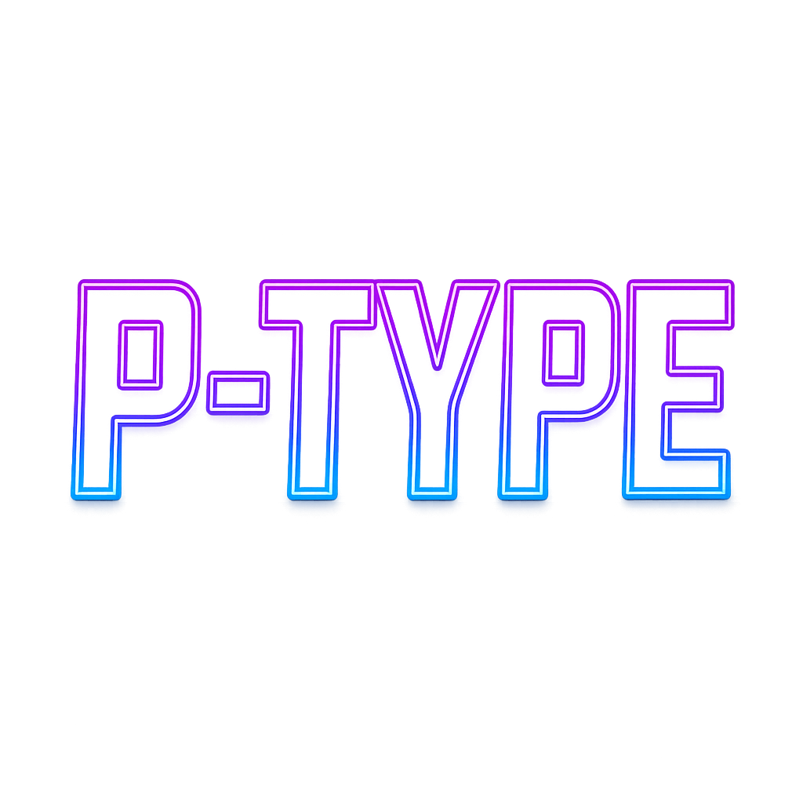

# P-Type: The Typing Game



P-Type is a modern, educational typing game where players defend against waves of enemy spaceships by typing words as fast and accurately as possible. With a sleek space-themed interface and multiple game modes, P-Type combines the thrill of action gaming with typing practice to improve WPM and accuracy.

## Features

### Core Gameplay
- **Real-time Typing Combat**: Defend your spaceship by typing words that destroy incoming enemy ships
- **Progressive Difficulty**: Advance through 100 levels with increasing speed and complexity
- **Health & Shield System**: Survive enemy attacks with health points and shield boosts
- **Boss Battles**: Face tougher enemies requiring longer text strings
- **Timer-based Play**: See how long you can survive against endless waves

### Game Modes
- **Normal Mode**: Practice typing English words organized by difficulty (beginner/intermediate/advanced)
- **Programming Mode**: Enhance coding skills with syntax and snippets from:
  - Python
  - JavaScript
  - Java
  - C#
  - C++
  - CSS
  - HTML

### Advanced Features
- **Bonus Items**: Collect power-ups including:
  - Seeking Missiles (homing projectiles)
  - Shield Boost (instant shield restoration)
  - Health Pack (HP regeneration)
  - Time Freeze (pause enemies temporarily)
- **EMP Weapon**: Area-of-effect attack to clear multiple enemies
- **Visual Effects**: Lasers, explosions, particle effects, and animated typing feedback
- **Multiple Ship Types**: Upgradeable player ships with different abilities

### Progression & Stats
- **Profile System**: Multiple player profiles with persistent statistics
- **Achievements**: Unlock 18+ achievements for milestones like typing speed, accuracy, and boss defeats
- **High Scores**: Global and personal best scoreboards
- **Detailed Statistics**: Track WPM, accuracy, words typed, perfection streaks, and more
- **Trivia Mode**: Answer questions after boss defeats for bonus items and rewards

### Technical Features
- **Cross-platform**: Runs on Windows, macOS, and Linux
- **Modern UI**: Resizable window with sleek dark theme and neon accents
- **Audio System**: Procedural sound effects and background music
- **Save/Load**: Continue games across sessions with automatic saving
- **Settings**: Adjustable music/sound volumes and preference control

## Installation

### Prerequisites
- Python 3.8 or higher
- pip package manager

### Dependencies
Install required packages using pip:

```bash
pip install -r requirements.txt
```

Required packages:
- pygame>=2.5.0
- numpy>=1.24.0  # Required for sound effect generation
- pytablericons>=1.1.0  # Icon system for UI elements
- Pillow>=10.0.0  # Image processing for icon conversion
- PyYAML>=6.0.0 

### Running the Game
1. Navigate to the project root directory
2. Run the entry script:
   ```bash
   python ptype/ptype.py
   ```
   Or from within the ptype directory:
   ```bash
   python ptype.py
   ```

### Build for Distribution
For creating standalone executables, use PyInstaller:
```bash
pyinstaller ptype/ptype.spec
```

## Usage Guide

### Getting Started
1. **Create/Load Profile**: Select or create a player profile to track your progress
2. **Choose Game Mode**: Select Normal mode or choose a programming language
3. **Start Playing**: Type the text displayed on enemy ships to destroy them
4. **Monitor Stats**: Watch your WPM, accuracy, and level in real-time

### Profiles
- **Profile Management**: Create, select, and manage multiple player profiles
- **Persistent Progress**: Stats, achievements, and saves are tied to your profile
- **Statistics Tracking**: Comprehensive metrics across all game modes

### Controls
- **Typing**: Type letters to spell enemy words
- **Backspace**: Correct mistakes in current word
- **Enter**: Activate EMP weapon (with cooldown)
- **↑/↓ Arrows**: Cycle through bonus items
- **←/→ Arrows**: Switch between ship types
- **Escape**: Pause/unpause game
- **F11/Alt+Enter**: Toggle fullscreen (handled by window manager)

### Power-ups & Abilities
- **Rapid Fire**: Increased firing rate for a limited time
- **Multi-shot**: Fire multiple projectiles simultaneously
- **Invincibility**: Become temporarily immune to damage
- **Time Slow**: Slow down enemy movement
- **EMP**: Clear all nearby enemies instantly

## Game Mechanics

### Typing System
- Type words exactly as shown on enemy ships
- Correct letters turn green, incorrect letters cause visual feedback
- Complete words to destroy enemies and earn points
- Incorrect words take no action and may cause partial damage

### Progression
- **Levels 1-7**: Beginner difficulty words
- **Levels 8-15**: Intermediate difficulty
- **Levels 16+**: Advanced difficulty
- **Boss Waves**: Every few levels, face extra resilient bosses
- **Scaling Difficulty**: Enemy spawn rates increase with level progression

### Scoring
- **Word Completion**: Base points per word typed
- **Accuracy Bonus**: Higher points for perfect accuracy
- **Combo Multipliers**: Bonus for typing multiple words correctly in sequence
- **Boss Multipliers**: Extra points for defeating boss enemies
- **Survival Bonus**: Points based on game duration and health remaining

### Difficulty Scaling
- Enemy speed increases with level
- Boss frequency increases over time
- Word length and complexity ramps progressively
- Some modes introduce special enemy types with unique mechanics

## Architecture

### Code Structure
The game follows a modular architecture with clear separation of concerns:

```
ptype/
├── ptype.py                 # Entry point and environment setup
├── core/
│   ├── app.py              # Main game class and loop
│   ├── game_state.py       # State management and saves
│   ├── types.py            # Enums and dataclasses
│   ├── settings.py         # Persistence and configuration
│   ├── profiles.py         # Player data structures
│   ├── profile_manager.py  # Profile CRUD operations
│   ├── achievements.py     # Achievement definitions
│   ├── environment.py      # Cross-platform compatibility
│   └── initialization.py   # Asset loading and setup
├── gameplay/
│   ├── game_updates.py      # Main game update loop
│   ├── enemy_management.py  # Enemy AI and spawning
│   ├── input_management.py  # Typing input handling
│   ├── bonuses.py          # Power-up effects
│   └── emp.py              # EMP weapon system
├── entities/
│   ├── player.py           # Player ship logic
│   └── enemies.py          # Enemy ship classes
├── ui/
│   ├── ui_manager.py       # UI element coordination
│   ├── screens.py          # Screen renderers
│   ├── hud.py              # In-game overlay
│   ├── window_manager.py   # Window handling
│   └── widgets.py          # Custom UI components
├── graphics/
│   ├── ships.py            # Ship visuals
│   └── stars.py            # Background effects
├── effects/
│   └── effects.py          # Visual effects
├── audio/
│   └── sound_manager.py    # Sound effects system
├── data/
│   ├── word_dictionary.py  # Word collections
│   └── trivia_db.py        # Trivia and bonuses
└── core/assets/            # Images and sounds
```

### Technical Details
- **Engine**: Pygame 2.x for game logic and rendering
- **Language**: Python 3.8+
- **Architecture**: Object-oriented with modular design
- **Persistence**: JSON-based save system
- **Audio**: Procedural sound generation and MP3 playback
- **Performance**: Optimized for 60 FPS with particle effects

## Contributing

Contributions are welcome! The project follows standard Python development practices.

### Development Setup
1. Fork and clone the repository
2. Create a virtual environment:
   ```bash
   python -m venv venv
   source venv/bin/activate  # On Windows: venv\Scripts\activate
   ```
3. Install dependencies:
   ```bash
   pip install -r requirements.txt
   ```
4. Run tests and add features

### Code Style
- Follow PEP 8 conventions
- Use type hints where possible
- Keep functions small and focused
- Document complex logic with comments

### Adding Features
- New game modes: Extend `GameMode` enum and add rendering logic
- New programming languages: Update `ProgrammingLanguage` enum and word dictionaries
- New achievements: Add to `ACHIEVEMENTS` dictionary in achievements.py

## Troubleshooting

### Common Issues
- **No audio**: Check pygame mixer initialization; fallback to no sound mode
- **Window sizing**: Issues on some Linux systems; uses fallback sizing
- **Performance**: Reduce particle effects or lower resolution on slow systems
- **Unicode issues**: Game handles most printable characters; some special chars may not work

### Debug Mode
Enable debug output by checking console for initialization messages and error details.

## Version History

- **v1.5.3** (WIP Edition, 2025-09-29): Current development version
  - Enhanced UI responsiveness
  - Improved cross-platform compatibility
  - Expanded programming language support
  - New achievement system
  - Modern visual design updates

## License

This project is licensed under the MIT License - see the LICENSE file for details.

## Credits

P-Type - The Typing Game is developed in Python with pygame.

### Special Thanks
- Open source community for pygame and pysdl2
- Icon providers (Tabler Icons)
- Python community for extensive ecosystem

---

Enjoy improving your typing skills while defending the galaxy in P-Type!
