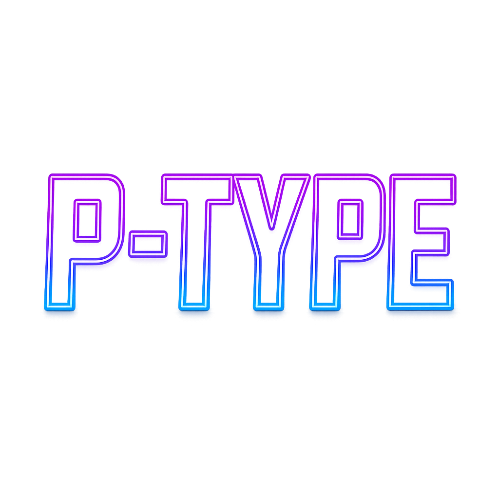
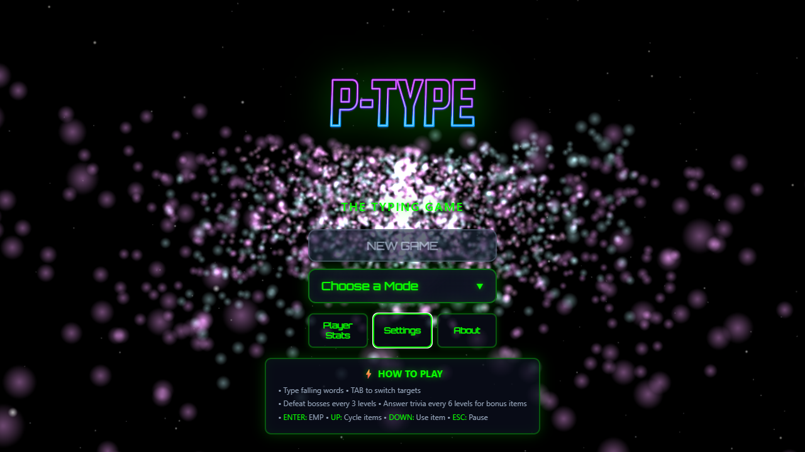

<p align="center">
  
</p>

<p align="center"><strong>Type fast. Defend your ship. Survive the next wave.</strong></p>

<p align="center">
  <a href="https://randynorthrup.github.io/ptype/">Play in your browser</a> ·
  <a href="https://github.com/RandyNorthrup/ptype/releases">Releases</a> ·
  <a href="#development">Development</a> ·
  <a href="https://github.com/RandyNorthrup/ptype/issues">Report an issue</a>
</p>

<p align="center">
  <a href="https://github.com/RandyNorthrup/ptype/actions/workflows/quality.yml"></a>
  <a href="https://github.com/RandyNorthrup/ptype/actions/workflows/build-multiplatform.yml"></a>
  <a href="LICENSE"></a>
</p>

P-Type is a 3D typing game built with React and Three.js. Type incoming words to
destroy enemy ships, fight bosses, answer trivia, and collect power-ups. Game
content, fonts, models, and audio ship with this repository; no account, backend,
API key, or environment file is required.



## Play

Open **[P-Type on GitHub Pages](https://randynorthrup.github.io/ptype/)**, choose a
mode, then select **New Game**. Use a hardware keyboard and a browser with WebGL
enabled. Settings control music, sound effects, and starting difficulty.

| Feature           | What to expect                                               |
| ----------------- | ------------------------------------------------------------ |
| Normal mode       | Tiered English word lists                                    |
| Programming modes | Python, JavaScript, Java, C#, C++, CSS, and HTML             |
| Difficulty        | Easy, Normal, Hard, Expert, and Master                       |
| Bosses and trivia | Boss every three levels; trivia every six levels             |
| Progress          | Local statistics, high scores, settings, and 19 achievements |
| PWA               | Install where supported; resources cached as they load       |

Progress belongs to this browser and site origin. Clearing site storage removes
saved progress; there is no account sync or cloud backup. Large models and media
use runtime caching. Full offline recovery has not been certified.

### Controls

| Key            | Action                                                     |
| -------------- | ---------------------------------------------------------- |
| Character keys | Type the target, including digits, punctuation, and spaces |
| `Tab`          | Cycle targets                                              |
| `Enter`        | Fire the EMP when ready                                    |
| `Arrow Up`     | Select the next collected bonus item                       |
| `Arrow Down`   | Use the selected bonus item                                |
| `Escape`       | Pause/resume or close dismissible dialogs                  |

Menus and dialogs support keyboard navigation, visible focus, focus containment
and restoration, and reduced-motion preferences. Dialogs and HUD adapt to narrow
screens. Gameplay needs a keyboard; responsive layout does not supply touch-only
controls. Leaving a game requires an in-app confirmation.

## Development

Use **Node.js 24.4+** and **npm 11.4.2+**, matching the declared engine ranges.
The full quality toolchain also needs Python 3.12+ and pinned native scanners;
see [tool setup and operations](docs/DEPLOYMENT.md#vm-and-tools).

```bash
npm ci --ignore-scripts
npm run dev
```

Visit `http://localhost:5173/ptype/`. Vite does not open a browser automatically.
On Windows, use `npm.cmd` if PowerShell blocks `npm.ps1`.

| Command                    | Purpose                                                            |
| -------------------------- | ------------------------------------------------------------------ |
| `npm run build`            | Type-check and create `dist/`                                      |
| `npm run preview`          | Serve the build at `http://localhost:4173/ptype/`                  |
| `npm test`                 | Unit/component tests with coverage floors                          |
| `npm run test:watch`       | Interactive Vitest watch mode                                      |
| `npm run quality`          | Complete code gates and reachable-history secret scan              |
| `npm run quality:code`     | Static/build gates, red drills, and browser journeys               |
| `npm run test:red`         | Inject defects in isolation; require failure and exact restoration |
| `npm run test:browser`     | Muted desktop, narrow, and development Chromium journeys           |
| `npm run test:browser:dev` | Build and check development HTML/CSP behavior                      |

Install hooks in an isolated Python environment after installing the native
tools and making their verified executables available on `PATH`:

```powershell
python -m venv .quality-tools/python
.quality-tools/python/Scripts/python.exe -m pip install --require-hashes -r requirements-quality.txt
.quality-tools/python/Scripts/pre-commit.exe install
```

Every commit runs `quality:code` and staged-secret hooks. CI runs the same code
aggregate plus the retained history scan on PRs, default-branch pushes, and
version tags. `ci:parity` rejects omitted/conditional gates and skipped commit
aggregates. Main requires successful Quality and Windows/macOS/Linux builds.

The enforced coverage floors are 94% statements, 82% branches, 97% functions,
and 95% lines. WebGL render-loop files are outside the jsdom coverage denominator;
scene tests advance production callbacks with model/font I/O mocked. Real browser
journeys use software WebGL. These checks do not certify physical GPUs, audible
playback, every browser engine, or full offline behavior. See
[verification scope](docs/QUALITY-RETROFIT.md).

## Architecture and distribution

React 19, strict TypeScript 6, Vite 8, Three.js, React Three Fiber, and Drei power
the app. React Context owns runtime state; validated browser storage retains
progress. Vitest, Testing Library, axe-core, and Playwright cover tested behavior.
The lockfile records exact dependency versions.

```text
public/assets/   Fonts, icons, images, audio, and GLB models
public/data/     Eight word dictionaries and trivia
src/components/ Accessible UI and WebGL scene components
src/entities/   Player and enemy entities
src/store/      Game state and local persistence
src/utils/      Content loaders, asset URLs, and game-domain managers
tests/          Unit, scene, browser, parity, and red-drill checks
docs/           Content inventory, operations, and verification evidence
```

GitHub Pages serves the static build under `/ptype/`. A main-only deployment gate
checks exact source and all four trusted Actions checks before publishing.
Manifest and service-worker scope follow the project path. Vercel configuration
and retired GitHub deployment records were removed.

Version [2.0.1](https://github.com/RandyNorthrup/ptype/releases/tag/v2.0.1) is a published static web/PWA distribution. Its release ZIP carries the
complete build and source identity, with SHA-256 checksums. Older release assets
remain available; the current build does not produce native desktop installers.
See [releases](https://github.com/RandyNorthrup/ptype/releases) for published status.

The historical Icons8 key was owner-confirmed revoked/rotated, then removed by
an explicitly authorized exact-value history scrub. Required history scanning
passes. Existing release tags/assets were preserved. Old clones must
resynchronize; see [security guidance](SECURITY.md).

## Contribute and learn more

- [Contribution workflow](CONTRIBUTING.md)
- [Changelog](CHANGELOG.md)
- [Content inventory](docs/CONTENT.md)
- [Deployment, release, rollback, and tool setup](docs/DEPLOYMENT.md)
- [Quality audit and evidence](docs/QUALITY-RETROFIT.md)
- [Canonical delivery plan](PLAN.md)
- [Private vulnerability reporting](SECURITY.md)

Created by Randy Northrup. Released under the [MIT License](LICENSE).
If you would like to support the project,
[donate through PayPal](https://www.paypal.com/donate/?hosted_button_id=Q9VC7B42R7K82)
or use the repository's Sponsor link.
